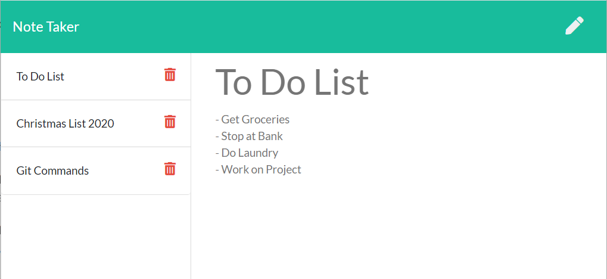

# Note Taker

## Description of the Application
This application allows the user to create, view, and delete notes that can be accessed from anywhere.

 

## How it Works
- Click on the "Note Title" and "Note Text" fields to enter the information you'd like to save.
- Once you are satisfied with the content, click on the Save icon in the upper-right-hand corner of the screen.
- Upon saving, the note will appear in the left-hand column. You may click on it to pull up the Note Text Content when you wish to revisit it.
- To create additional new notes, click on the pencil icon in the top-right corner, and follow the same steps as before.
- To delete, simply select the trash can icon of the note to be removed on the left-side column.

 

## Additional App Features
* Application uses a back-end server created utilizing Express, allowing for data to be accessed and manipulated through the client-side application.
  
 

## Link to GitHub Repository
https://github.com/chriswein12/note-taker

 

## Link to Application
https://warm-coast-31838.herokuapp.com/

 

## How the Website Looks

 

## Credits

*Project completed by Chris Wein*